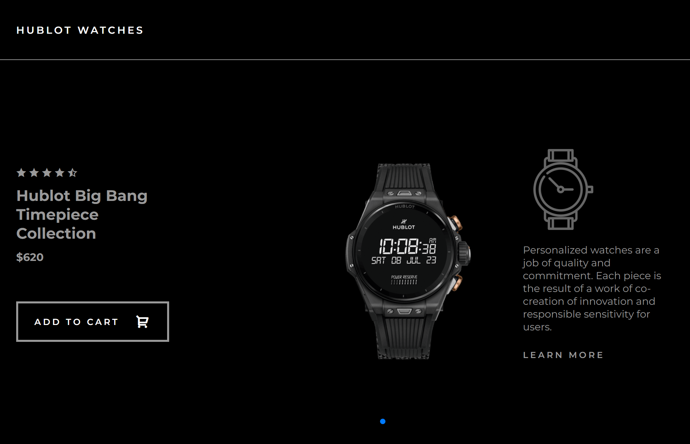

# Hublot Watches Landing Page

This is a landing page website for Hublot watches, showcasing premium watch designs with smooth animations and interactive sliders. The website is built using **HTML**, **CSS**, and **JavaScript**, and incorporates the **GSAP** and **Swiper JS** libraries for advanced animations and carousel features.

## Screenshots



## Demo

[Demo site](https://hublot-watches.netlify.app/)

## Features

- **Responsive Design:** The landing page is fully responsive and adapts seamlessly to different screen sizes, including mobile, tablet, and desktop.
- **Smooth Animations:** Utilizes **GSAP (GreenSock Animation Platform)** to create smooth, performant animations for elements such as text, images, and buttons.
- **Interactive Slider:** A sleek, touch-enabled image carousel for showcasing different watch models using **Swiper JS**.
- **Cross-browser Compatibility:** Works on all modern web browsers.

## Technologies Used

- **HTML5**
- **CSS3**
  - Flexbox & Grid for layout
  - Custom animations and transitions
- **JavaScript (ES6)**
  - DOM Manipulation
  - Event Handling
- **GSAP (GreenSock Animation Platform)**
  - Used for animations like fade-ins, slide-ins, and hover effects.
- **Swiper JS**
  - For creating a responsive image slider with touch and swipe support.

## Installation

To run the project locally:

1. Clone the repository:

   ```bash
   git clone https://github.com/yourusername/hublot-watches-landing.git
   ```

2. Navigate into the project directory:

   ```bash
   cd hublot-watches-landing
   ```

3. Open the `index.html` file in your browser to view the website.

## Usage

- On the home page, users can view featured Hublot watch models and explore the available collections using the interactive slider.
- Animations are triggered when users scroll through the page or interact with elements.

## Libraries

- **GSAP**: A robust library for creating high-performance animations.
  - [GSAP Documentation](https://greensock.com/gsap/)
- **Swiper JS**: A modern touch slider with hardware-accelerated transitions.
  - [Swiper JS Documentation](https://swiperjs.com/)

## Contributing

Feel free to submit issues or pull requests if you have any suggestions or improvements.

## License

This project is licensed under the MIT License - see the [LICENSE](LICENSE) file for details.
